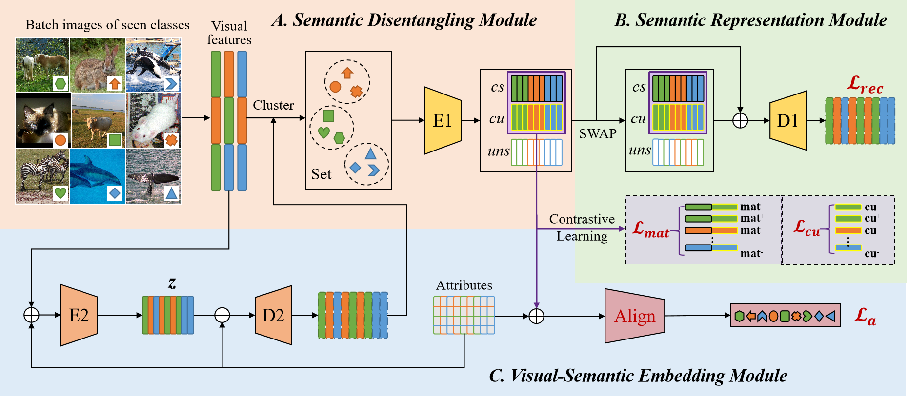

# CSDR

Codes for the paper: Improving Generalized Zero-Shot Learning via Cluster-based Semantic Disentangling Representation

### Dependencies
This codes requires the following:
- Python 3.8.10
- Pytorch 1.7.1
- kmeans_pytorch

### Datasets

Download the dataset (AWA2/CUB/FLO/SUN) from the work of [Xian et al. (CVPR2017)](http://datasets.d2.mpi-inf.mpg.de/xian/xlsa17.zip), and save correspongding data into directory `./data/`. 

### Train and Test

Run `python train.py` with the following args:

